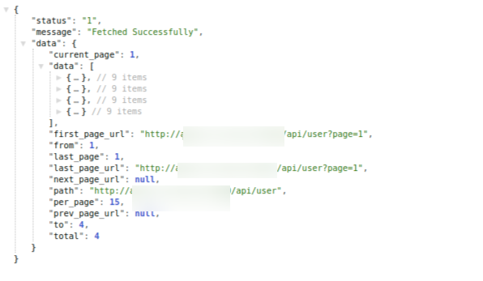

# Vue JS Datatable component.
* Table Component for Vue js supporting server and client slide rendering with pagination and sorting
* If URL is supplied as a prop, then the data is fetched from the url. Receives data as props too.
# Features
* Server side search
* Local In memory Searching (WIP)
* Sort the Columns 
* Supports custom heading through custom function.
* Allows transformation of values through custom function.
* Pagination
* Allows selection of columns for display.
* Additional Column can be added on the fly, with custom transformer function
* Selection of columns which are rendered as html through props `html`

# Props
The component accepts following props for further customization:
```js
    items: Array, //Items passed as prop for local side data
    headingTransformer: Function, // the transformer function if data in the heading needs some transformation before rendering
    valueTransformer: Function, // the transformer function if data  needs some transformation before rendering
    html: Array, //An array of columns which accept html content TOTO
    additionalColumns: Array, //Additional columns which needs to be appended to the table
    additionalColumnsTransformer: Function, //The function which transfoms values for additional columns
    except: Array, // and array of columns excluded from displaying
    url: String, // the url which is used for fetching data from the server
    paginate: {
      type:Object,
      default:function(){
        return {enable:false}
      }
    }, // Pagiantion option for local data //TODO
    perPage: {
      type: Number,
      default: 10
    }
```
# Usage
import `vue-table` from "geeklearners-vue-table";

register the component 
 ` components: { vTable }`

 ## Minimal Usage

 ```js
 <v-table :items="items">
 
 </v-table>
```
## Customizing the table through props :
### Changing Columns Heading Label
By default, the column name is used as it is received from the server. Heading can be customized by providing a custom function `headingTransformer` as prop to `vue-table`. `headingTransformer` passes a default heading to the call back provided as prop and the value can be customized as required.

e.g. 
```js
<template>
<v-table :items="items" :headingTransformer="headingTransformer"/>
</template>
<script>
import vTable from "geeklearners-vue-table";
export default {
    components:{vTable},
    data:function(){
      return {
              items:[{},{},{}], //the data that need to be placed in data-table
      }
    },
    methods:{
      headingTransformer(val){
        return val.toUpperCase(); //returns value in uppercase
      }
    }
}
<script>
```
### Adding Extra Columns
If some additional columns need to be added to the display, they can be added using the `additionalColumns` and `additionalColumnsTransformer` props.

`additionalColumns` is an array defining the columns to be added to the table.
`additionalColumnsTransformer` is a function returning an Object containing column name as key and a callback function returning array of object as the value.

```js
<template>
<v-table :items="items"  :headingTransformer="headingTransformer" :html="html"/>
</template>
<script>
import vTable from "geeklearners-vue-table";
import { ToggleButton } from 'vue-js-toggle-button'
export default {
    components:{vTable},
    data:function(){
      return {
        items:[{},{},{}], //the data that need to be placed in data-table
        additionalColumns:['Action',"is_checked"],
        html:['Action']
      }
    },
    methods:{
      additionalColumnsTransformer(){
        return {
          Action:(row,val)=>{
            return [{
              item:'<a href=""></a>',
              handler:()=>null
            }]
          },
          //You could even pass custom vue component to be rendered in the additional column
          is_checked:(row,val)=>{
            return [
              {
                comp:ToggleButton, //component
                prop:{'checked':true} //pass in the props required by the component
              }
            ];
          }
        };
      }
    }
}
<script>
```
* Please note that all the columns that need some sort of transformation need to be added to `html` prop's array.
### Skipping some columns 
If some columns need to be skipped during rendering, those could be specified using `except` prop to the `vue-table`

```js
<vue-table :items="items" :except="['id','updated_at','created_at']"/>
```

### Transforming the value before rendering.
The columns which need to go through some sort of customization before rendering can be achieved using `valueTransformer` props. It's the same as 
`additionalColumnsTransformer` but operates on the data and processes them before rendering.

# This package fully supports server side pagination and searching integration. Just provide `url` props a url
The data returned from the server is expected to return the data in the following format:


## Advance Usage

```js 
        <v-table
            :headingTransformer="headingTransformer"
            :valueTransformer="valueTransformer"
            :html="['name']" //todo
            :additionalColumns="additionalColumns"
            :additionalColumnsTransformer="additionalColumnsTransformer"
            :except="except" //todo
            :paginate="localPaginate"
            :url="url"
          >
        </v-table>
```
# Example Usage:

```js 
<template>
    <div>
        <v-table  :items="data" :except="['states']"/>
    </div>
</template>
<script>
import vTable from "geeklearners-vue-table";

export default {
    components:{vTable},
    data:function(){
        return {
            data:[]
        }
    },
    mounted:function(){
        fetch("https://raw.githubusercontent.com/stefanbinder/countries-states/master/countries.json")
        .then(resp=>resp.json())
        .then(data=>{this.data=data})

    }
}
</script>
```
# <a target="_blank" href="https://vuejstabledemo.firebaseapp.com/">Online Demo</a>


